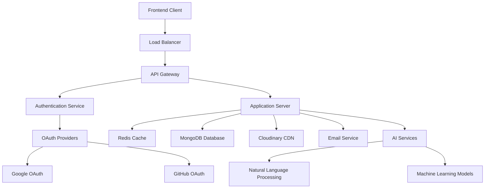
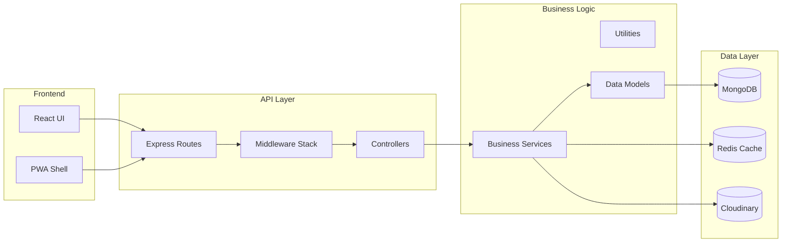
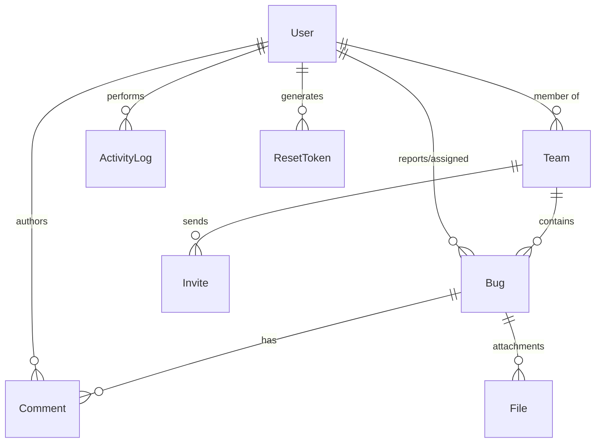
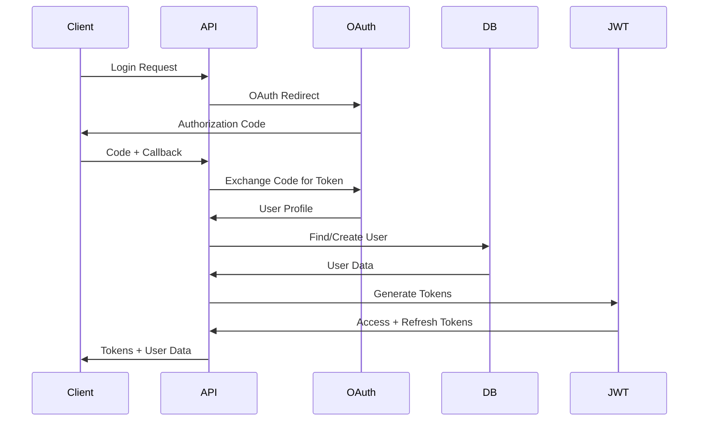
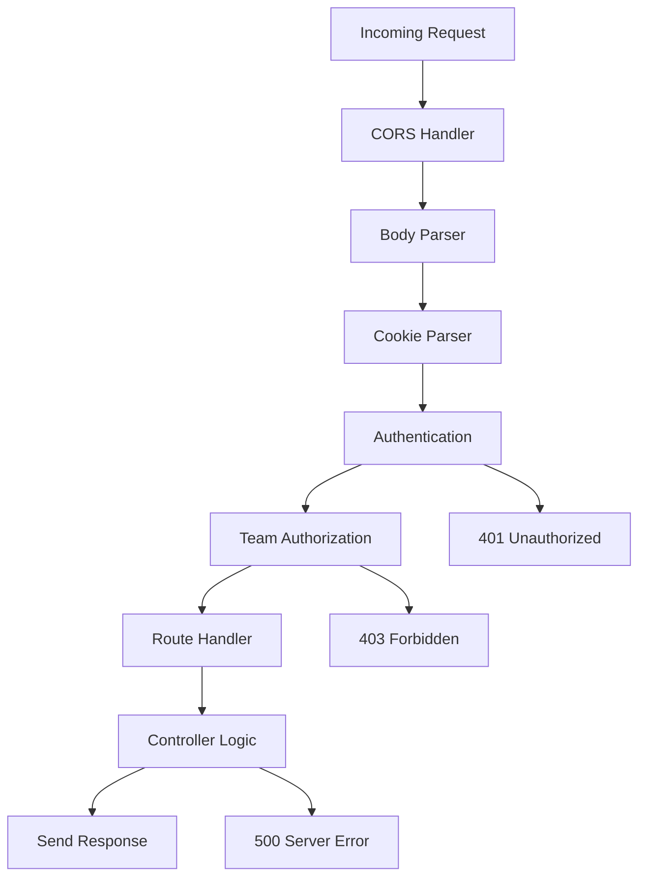
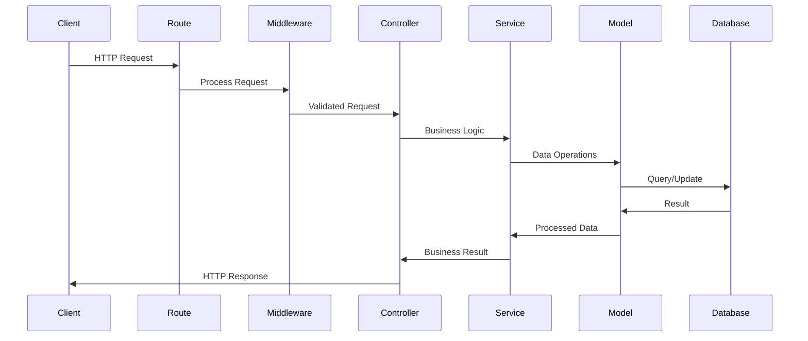
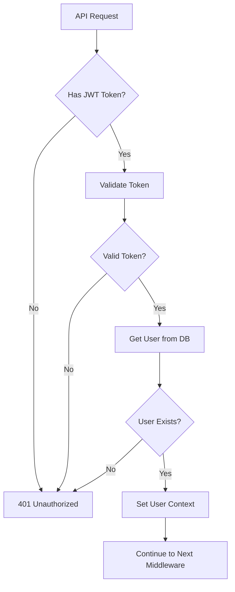
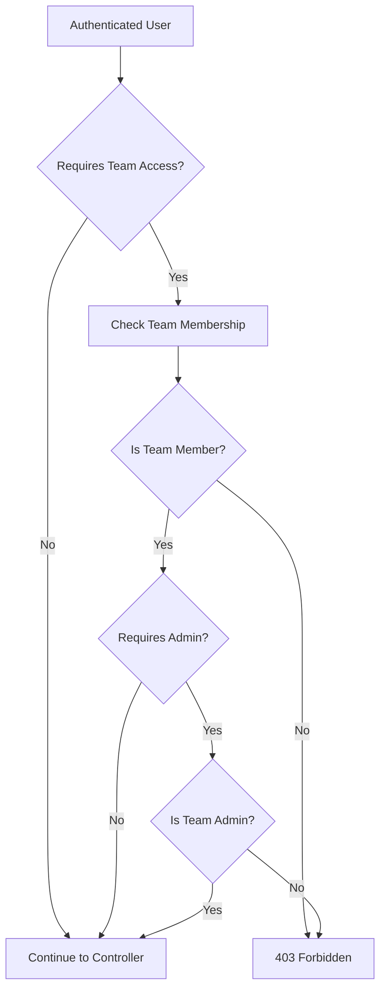

# BugSnap Backend Architecture Overview

## 🏗️ System Architecture

### High-Level Architecture



### Service Architecture



## 🔧 Core Components

### 1. Application Server (Express.js)

#### **Main Application** (`index.js`)
- **Purpose**: Application entry point and configuration
- **Responsibilities**:
  - Server initialization and middleware setup
  - Route registration and CORS configuration
  - Error handling and graceful shutdown
  - Swagger documentation mounting

#### **Core Dependencies**
```javascript
// Core Framework
const express = require("express");
const cors = require("cors");
const cookieParser = require("cookie-parser");

// Documentation
const swaggerJS = require("swagger-jsdoc");
const swaggerUI = require("swagger-ui-express");

// Database & Cache
const mongoose = require("mongoose");
const redis = require("redis");
```

### 2. Database Layer

#### **MongoDB with Mongoose**


#### **Key Models**
- **User**: Authentication, profile, team memberships
- **Team**: Team structure, member roles, settings
- **Bug**: Issue tracking, status, priority, assignments
- **Comment**: Discussions, mentions, rich text content
- **File**: Attachment metadata, Cloudinary integration
- **ActivityLog**: Audit trail, team activity tracking

### 3. Authentication & Authorization

#### **Authentication Flow**


#### **Authorization Levels**
- **Public**: No authentication required
- **Authenticated**: Valid JWT token required
- **Team Member**: Must be team member
- **Team Admin**: Administrative privileges
- **Resource Owner**: Access to owned resources

### 4. Middleware Stack

#### **Request Processing Pipeline**


#### **Custom Middleware**
- **`checkAuthentication`**: JWT validation and user context
- **`checkTeamMembership`**: Team access control
- **`checkTeamAdmin`**: Administrative permissions
- **`checkBugTeamMatch`**: Resource-level authorization
- **`multer`**: File upload handling
- **`redis`**: Caching and rate limiting
- **`error`**: Global error handling

## 📁 Project Structure Deep Dive

### **Core Directories**

#### `/controller` - Business Logic Controllers
```
controller/
├── bug.js          # Bug CRUD operations
├── comment.js      # Comment management
├── file.js         # File upload/management
├── oauth.js        # OAuth authentication
├── people.js       # Team member operations
├── team.js         # Team management
└── user.js         # User operations
```

#### `/routes` - API Endpoint Definitions
```
routes/
├── authRouter.js   # OAuth routes (/auth/*)
├── bot.js          # AI bot integration
├── bug.js          # Bug API (/bug/*)
├── comment.js      # Comments (/comment/*)
├── media.js        # File operations (/media/*)
├── people.js       # People management (/people/*)
├── team.js         # Team API (/team/*)
└── user.js         # User operations (/user/*)
```

#### `/model` - Data Models & Schemas
```
model/
├── activityLog.js  # Activity tracking
├── bug.js          # Bug entity schema
├── comment.js      # Comment schema
├── file.js         # File metadata
├── invite.js       # Team invitations
├── resetToken.js   # Password reset tokens
├── team.js         # Team structure
└── user.js         # User profiles
```

#### `/service` - Business Services
```
service/
├── auth.js         # JWT token management
├── encrypt.js      # Data encryption
└── couldinary.js   # File storage service
```

#### `/middleware` - Request Processing
```
middleware/
├── index.js        # Authentication middleware
├── error.js        # Global error handler
├── multer.js       # File upload middleware
├── redis.js        # Caching middleware
└── teamMiddleware.js # Team authorization
```

#### `/utils` - Utility Functions
```
utils/
├── dateFilterUtils.js  # Date filtering
├── logActivity.js      # Activity logging
├── queryUtils.js       # Database utilities
├── setTokenCookie.js   # Cookie management
└── teamUtils.js        # Team operations
```

## 🔄 Data Flow Patterns

### 1. Request-Response Cycle



### 2. Authentication Flow



### 3. Team Authorization Flow



## 🔧 Integration Points

### 1. External Services

#### **MongoDB Atlas**
- **Purpose**: Primary database for application data
- **Connection**: Mongoose ODM with connection pooling
- **Features**: Transactions, indexing, aggregation pipelines
- **Monitoring**: Built-in Atlas monitoring and alerts

#### **Redis (Upstash)**
- **Purpose**: Caching, session storage, rate limiting
- **Connection**: Redis client with clustering support
- **Use Cases**: 
  - JWT token blacklisting
  - API response caching
  - Rate limiting counters
  - Session data storage

#### **Cloudinary**
- **Purpose**: File storage, image processing, CDN
- **Integration**: Direct upload API with signed URLs
- **Features**: 
  - Automatic image optimization
  - Multiple format support
  - Global CDN delivery
  - File transformation APIs

### 2. OAuth Providers

#### **Google OAuth 2.0**
```javascript
// OAuth Configuration
const googleConfig = {
  clientId: process.env.Google_Client_Id,
  clientSecret: process.env.Google_Client_Secret,
  redirectUri: process.env.GOOGLE_REDIRECT_URI,
  scope: 'openid profile email'
};
```

#### **GitHub OAuth**
```javascript
// GitHub Integration
const githubConfig = {
  clientId: process.env.GITHUB_CLIENT_ID,
  clientSecret: process.env.GITHUB_CLIENT_SECRET,
  redirectUri: process.env.GITHUB_REDIRECT_URI,
  scope: 'user:email'
};
```

### 3. Email Service
- **Provider**: Gmail SMTP with app-specific passwords
- **Use Cases**: Welcome emails, password resets, notifications
- **Configuration**: Nodemailer with secure authentication

## 🚀 Performance Considerations

### 1. Database Optimization
- **Indexing Strategy**: Compound indexes on frequently queried fields
- **Query Optimization**: Aggregation pipelines for complex operations
- **Connection Pooling**: Mongoose connection pool configuration
- **Data Modeling**: Embedded vs. referenced documents optimization

### 2. Caching Strategy
- **Redis Caching**: Frequently accessed data caching
- **Response Caching**: API response caching with TTL
- **Database Query Caching**: Mongoose query result caching
- **File Caching**: Cloudinary CDN for static assets

### 3. Security Architecture
- **JWT Strategy**: Short-lived access tokens with refresh token rotation
- **Data Encryption**: AES-256 encryption for sensitive data
- **Input Validation**: Comprehensive request validation
- **Rate Limiting**: Redis-based rate limiting per IP/user

## 🔍 Monitoring & Observability

### 1. Application Metrics
- **Response Times**: API endpoint performance tracking
- **Error Rates**: Error frequency and categorization
- **Throughput**: Requests per second monitoring
- **Database Performance**: Query execution time tracking

### 2. Health Checks
- **Database Connectivity**: MongoDB connection health
- **Cache Availability**: Redis connection status
- **External Services**: OAuth provider availability
- **File Storage**: Cloudinary service health

### 3. Logging Strategy
- **Structured Logging**: JSON-formatted log entries
- **Log Levels**: Error, Warning, Info, Debug classification
- **Context Enrichment**: Request ID, user ID, team ID tracking
- **Centralized Logging**: Aggregated log collection and analysis

---

**Architecture Version**: 1.0.0  
**Last Updated**: October 2025  
**Review Schedule**: Quarterly  
**Next Review**: January 2026