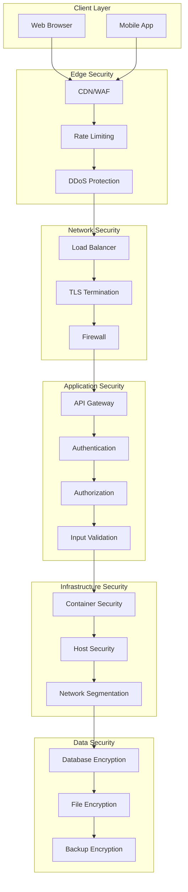
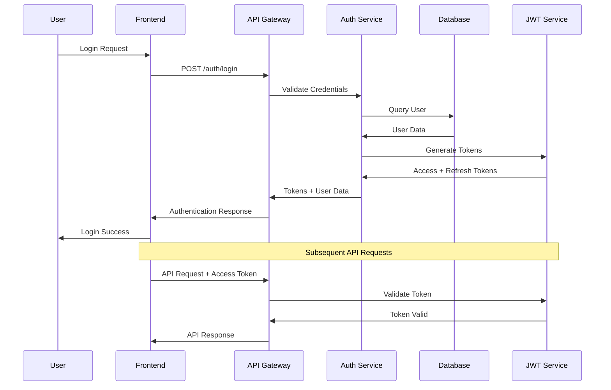
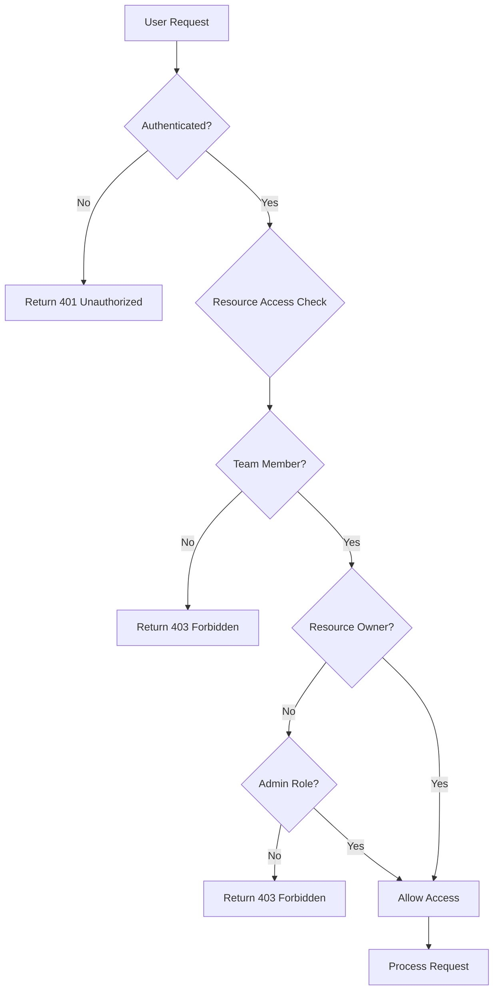

# BugSnap Security Architecture

## 🔒 Comprehensive Security Guide

This document outlines the security architecture, threat model, and security best practices implemented in BugSnap to protect user data and maintain system integrity.

## 🎯 Security Objectives

### Core Security Principles

#### Confidentiality
```yaml
Data Protection:
  - User credentials encrypted at rest and in transit
  - JWT tokens signed with strong secrets
  - Database connections encrypted with TLS
  - File uploads secured on Cloudinary

Access Control:
  - Role-based access control (RBAC)
  - Team-based data isolation
  - Resource-level permissions
  - Multi-factor authentication support
```

#### Integrity
```yaml
Data Integrity:
  - Input validation on all endpoints
  - Database constraints and validation
  - File upload virus scanning
  - API request signing

System Integrity:
  - Code signing and verification
  - Container image scanning
  - Infrastructure as code
  - Audit logging
```

#### Availability
```yaml
System Availability:
  - DDoS protection and rate limiting
  - Load balancing and failover
  - Database replication
  - Backup and disaster recovery

Service Resilience:
  - Circuit breaker patterns
  - Graceful degradation
  - Health monitoring
  - Incident response procedures
```

---

## 🏗️ Security Architecture

### Defense in Depth Model



### Authentication Flow



### Authorization Model



---

## 🔐 Authentication & Authorization

### JWT Token Security

#### Token Structure and Claims
```javascript
// Access Token (15 minutes expiry)
{
  "iss": "bugsnap-api",
  "sub": "user_id",
  "iat": 1640995200,
  "exp": 1640996100,
  "type": "access",
  "user": {
    "id": "user_id",
    "email": "user@example.com",
    "teams": ["team_id_1", "team_id_2"],
    "roles": ["user"]
  },
  "permissions": ["read:bugs", "write:bugs", "read:teams"],
  "jti": "token_unique_id"
}

// Refresh Token (7 days expiry)
{
  "iss": "bugsnap-api",
  "sub": "user_id",
  "iat": 1640995200,
  "exp": 1641600000,
  "type": "refresh",
  "jti": "refresh_token_unique_id"
}
```

#### Token Security Implementation
```javascript
// JWT service with enhanced security
const jwt = require('jsonwebtoken');
const crypto = require('crypto');

class JWTService {
    constructor() {
        this.accessTokenSecret = process.env.ACCESS_TOKEN_SECRET;
        this.refreshTokenSecret = process.env.REFRESH_TOKEN_SECRET;
        this.accessTokenExpiry = '15m';
        this.refreshTokenExpiry = '7d';
        
        // Token blacklist for logout
        this.blacklistedTokens = new Set();
    }
    
    generateTokenPair(user) {
        const jti = crypto.randomUUID();
        const refreshJti = crypto.randomUUID();
        
        const accessToken = jwt.sign({
            iss: 'bugsnap-api',
            sub: user._id.toString(),
            type: 'access',
            user: {
                id: user._id.toString(),
                email: user.email,
                teams: user.teams,
                roles: user.roles || ['user']
            },
            jti: jti
        }, this.accessTokenSecret, {
            expiresIn: this.accessTokenExpiry,
            algorithm: 'HS256'
        });
        
        const refreshToken = jwt.sign({
            iss: 'bugsnap-api',
            sub: user._id.toString(),
            type: 'refresh',
            jti: refreshJti
        }, this.refreshTokenSecret, {
            expiresIn: this.refreshTokenExpiry,
            algorithm: 'HS256'
        });
        
        return { accessToken, refreshToken };
    }
    
    verifyAccessToken(token) {
        try {
            if (this.blacklistedTokens.has(token)) {
                throw new Error('Token has been blacklisted');
            }
            
            const decoded = jwt.verify(token, this.accessTokenSecret);
            
            if (decoded.type !== 'access') {
                throw new Error('Invalid token type');
            }
            
            return decoded;
        } catch (error) {
            throw new Error('Invalid or expired token');
        }
    }
    
    verifyRefreshToken(token) {
        try {
            if (this.blacklistedTokens.has(token)) {
                throw new Error('Token has been blacklisted');
            }
            
            const decoded = jwt.verify(token, this.refreshTokenSecret);
            
            if (decoded.type !== 'refresh') {
                throw new Error('Invalid token type');
            }
            
            return decoded;
        } catch (error) {
            throw new Error('Invalid or expired refresh token');
        }
    }
    
    blacklistToken(token) {
        this.blacklistedTokens.add(token);
        
        // Clean up expired tokens periodically
        setTimeout(() => {
            this.blacklistedTokens.delete(token);
        }, 15 * 60 * 1000); // 15 minutes for access tokens
    }
}
```

### OAuth Security

#### OAuth Provider Configuration
```javascript
// Google OAuth security configuration
const GoogleStrategy = require('passport-google-oauth20').Strategy;

passport.use(new GoogleStrategy({
    clientID: process.env.GOOGLE_CLIENT_ID,
    clientSecret: process.env.GOOGLE_CLIENT_SECRET,
    callbackURL: `${process.env.APP_URL}/auth/google/callback`,
    scope: ['profile', 'email'],
    state: true, // CSRF protection
    passReqToCallback: true
}, async (req, accessToken, refreshToken, profile, done) => {
    try {
        // Verify state parameter for CSRF protection
        const state = req.query.state;
        const expectedState = req.session.oauthState;
        
        if (state !== expectedState) {
            return done(new Error('Invalid state parameter'));
        }
        
        // Validate profile data
        if (!profile.emails || profile.emails.length === 0) {
            return done(new Error('No email provided by OAuth provider'));
        }
        
        const email = profile.emails[0].value;
        const name = profile.displayName;
        
        // Find or create user
        let user = await User.findOne({ email });
        
        if (!user) {
            user = new User({
                name,
                email,
                provider: 'google',
                providerId: profile.id,
                isVerified: true,
                profilePicture: profile.photos[0]?.value
            });
            await user.save();
        } else {
            // Update user info if needed
            user.lastLogin = new Date();
            await user.save();
        }
        
        return done(null, user);
    } catch (error) {
        return done(error);
    }
}));
```

### Role-Based Access Control (RBAC)

#### Permission System
```javascript
// Permission definitions
const PERMISSIONS = {
    // Bug permissions
    'bugs:read': 'Read bug reports',
    'bugs:write': 'Create and update bug reports',
    'bugs:delete': 'Delete bug reports',
    'bugs:assign': 'Assign bugs to team members',
    
    // Team permissions
    'teams:read': 'View team information',
    'teams:write': 'Update team settings',
    'teams:invite': 'Invite team members',
    'teams:remove': 'Remove team members',
    'teams:admin': 'Full team administration',
    
    // User permissions
    'users:read': 'View user profiles',
    'users:write': 'Update user profiles',
    'users:admin': 'User administration',
    
    // File permissions
    'files:upload': 'Upload files',
    'files:delete': 'Delete files'
};

// Role definitions
const ROLES = {
    user: [
        'bugs:read',
        'bugs:write',
        'teams:read',
        'users:read',
        'users:write',
        'files:upload'
    ],
    
    team_admin: [
        ...ROLES.user,
        'bugs:assign',
        'teams:write',
        'teams:invite',
        'teams:remove'
    ],
    
    team_owner: [
        ...ROLES.team_admin,
        'teams:admin',
        'bugs:delete'
    ],
    
    system_admin: [
        ...Object.keys(PERMISSIONS)
    ]
};

// Permission middleware
const requirePermission = (permission) => {
    return async (req, res, next) => {
        try {
            const user = req.user;
            const userPermissions = getUserPermissions(user);
            
            if (!userPermissions.includes(permission)) {
                return res.status(403).json({
                    success: false,
                    message: 'Insufficient permissions',
                    required: permission
                });
            }
            
            next();
        } catch (error) {
            return res.status(500).json({
                success: false,
                message: 'Authorization error'
            });
        }
    };
};

// Dynamic permission calculation
const getUserPermissions = (user) => {
    const permissions = new Set();
    
    // Add base user permissions
    ROLES.user.forEach(perm => permissions.add(perm));
    
    // Add team-based permissions
    user.teams?.forEach(team => {
        if (team.role === 'admin') {
            ROLES.team_admin.forEach(perm => permissions.add(perm));
        }
        if (team.role === 'owner') {
            ROLES.team_owner.forEach(perm => permissions.add(perm));
        }
    });
    
    // Add system admin permissions
    if (user.roles?.includes('system_admin')) {
        ROLES.system_admin.forEach(perm => permissions.add(perm));
    }
    
    return Array.from(permissions);
};
```

---

## 🛡️ Data Protection

### Encryption at Rest

#### Database Encryption
```javascript
// MongoDB encryption configuration
const mongoose = require('mongoose');
const crypto = require('crypto');

// Field-level encryption for sensitive data
const encryptionKey = Buffer.from(process.env.ENCRYPTION_KEY, 'hex');

const encrypt = (text) => {
    const iv = crypto.randomBytes(16);
    const cipher = crypto.createCipher('aes-256-cbc', encryptionKey);
    let encrypted = cipher.update(text, 'utf8', 'hex');
    encrypted += cipher.final('hex');
    return iv.toString('hex') + ':' + encrypted;
};

const decrypt = (encryptedText) => {
    const parts = encryptedText.split(':');
    const iv = Buffer.from(parts[0], 'hex');
    const encrypted = parts[1];
    const decipher = crypto.createDecipher('aes-256-cbc', encryptionKey);
    let decrypted = decipher.update(encrypted, 'hex', 'utf8');
    decrypted += decipher.final('utf8');
    return decrypted;
};

// Schema with encryption
const userSchema = new mongoose.Schema({
    email: {
        type: String,
        required: true,
        unique: true,
        lowercase: true
    },
    password: {
        type: String,
        required: true,
        set: (password) => encrypt(password) // Encrypt before saving
    },
    // Other fields...
});

// Decrypt on retrieval
userSchema.methods.getDecryptedPassword = function() {
    return decrypt(this.password);
};
```

#### File Encryption
```javascript
// Cloudinary upload with encryption
const cloudinary = require('cloudinary').v2;
const crypto = require('crypto');

const uploadSecureFile = async (fileBuffer, filename) => {
    try {
        // Encrypt file before upload
        const key = crypto.randomBytes(32);
        const iv = crypto.randomBytes(16);
        const cipher = crypto.createCipher('aes-256-cbc', key);
        
        let encrypted = Buffer.concat([
            cipher.update(fileBuffer),
            cipher.final()
        ]);
        
        // Upload encrypted file
        const result = await cloudinary.uploader.upload_stream({
            resource_type: 'raw',
            public_id: `encrypted/${filename}`,
            tags: ['encrypted']
        }, (error, result) => {
            if (error) throw error;
            return result;
        }).end(encrypted);
        
        // Store encryption key securely (in database)
        return {
            url: result.secure_url,
            encryptionKey: key.toString('hex'),
            iv: iv.toString('hex')
        };
    } catch (error) {
        throw new Error('File encryption failed');
    }
};
```

### Encryption in Transit

#### TLS Configuration
```javascript
// Express.js TLS security headers
const helmet = require('helmet');

app.use(helmet({
    hsts: {
        maxAge: 31536000,
        includeSubDomains: true,
        preload: true
    },
    contentSecurityPolicy: {
        directives: {
            defaultSrc: ["'self'"],
            styleSrc: ["'self'", "'unsafe-inline'"],
            scriptSrc: ["'self'"],
            imgSrc: ["'self'", "data:", "https:"],
            connectSrc: ["'self'", "https://api.bugsnap.codemine.tech"],
            fontSrc: ["'self'"],
            objectSrc: ["'none'"],
            mediaSrc: ["'self'"],
            frameSrc: ["'none'"]
        }
    },
    crossOriginEmbedderPolicy: false
}));

// Force HTTPS in production
if (process.env.NODE_ENV === 'production') {
    app.use((req, res, next) => {
        if (req.header('x-forwarded-proto') !== 'https') {
            return res.redirect(`https://${req.header('host')}${req.url}`);
        }
        next();
    });
}
```

---

## 🚫 Input Validation & Sanitization

### Request Validation
```javascript
// Joi validation schemas
const Joi = require('joi');

const validationSchemas = {
    createBug: Joi.object({
        title: Joi.string()
            .min(5)
            .max(200)
            .required()
            .trim()
            .pattern(/^[a-zA-Z0-9\s\-_.,!?()]+$/), // Alphanumeric + basic punctuation
        
        description: Joi.string()
            .min(10)
            .max(5000)
            .required()
            .trim(),
        
        priority: Joi.string()
            .valid('low', 'medium', 'high', 'critical')
            .required(),
        
        severity: Joi.string()
            .valid('minor', 'major', 'critical', 'blocker')
            .required(),
        
        teamId: Joi.string()
            .pattern(/^[0-9a-fA-F]{24}$/) // MongoDB ObjectId
            .required(),
        
        assigneeId: Joi.string()
            .pattern(/^[0-9a-fA-F]{24}$/)
            .optional(),
        
        tags: Joi.array()
            .items(Joi.string().max(20).pattern(/^[a-zA-Z0-9\-_]+$/))
            .max(10)
            .optional(),
        
        stepsToReproduce: Joi.array()
            .items(Joi.string().max(500))
            .max(20)
            .optional()
    }),
    
    userRegistration: Joi.object({
        name: Joi.string()
            .min(2)
            .max(50)
            .required()
            .trim()
            .pattern(/^[a-zA-Z\s]+$/), // Letters and spaces only
        
        email: Joi.string()
            .email({ minDomainSegments: 2 })
            .required()
            .lowercase()
            .trim(),
        
        password: Joi.string()
            .min(8)
            .max(128)
            .required()
            .pattern(/^(?=.*[a-z])(?=.*[A-Z])(?=.*\d)(?=.*[@$!%*?&])[A-Za-z\d@$!%*?&]+$/) // Strong password
    })
};

// Validation middleware
const validate = (schema) => {
    return (req, res, next) => {
        const { error, value } = schema.validate(req.body, {
            abortEarly: false,
            stripUnknown: true
        });
        
        if (error) {
            return res.status(400).json({
                success: false,
                message: 'Validation error',
                errors: error.details.map(detail => ({
                    field: detail.path.join('.'),
                    message: detail.message
                }))
            });
        }
        
        req.body = value;
        next();
    };
};
```

### SQL Injection Prevention
```javascript
// MongoDB injection prevention
const mongoSanitize = require('express-mongo-sanitize');

// Remove any keys that start with '$' or contain '.'
app.use(mongoSanitize({
    replaceWith: '_',
    onSanitize: ({ req, key }) => {
        console.warn(`Sanitized key: ${key} in request to ${req.path}`);
    }
}));

// Additional query sanitization
const sanitizeQuery = (query) => {
    const sanitized = {};
    
    for (const [key, value] of Object.entries(query)) {
        // Remove MongoDB operators
        if (typeof key === 'string' && !key.startsWith('$')) {
            if (typeof value === 'string') {
                sanitized[key] = value.replace(/[{}[\]]/g, ''); // Remove brackets
            } else if (typeof value === 'object' && value !== null) {
                sanitized[key] = sanitizeQuery(value); // Recursive sanitization
            } else {
                sanitized[key] = value;
            }
        }
    }
    
    return sanitized;
};
```

### XSS Prevention
```javascript
// XSS sanitization
const xss = require('xss');

const xssOptions = {
    whiteList: {
        // Allowed HTML tags and attributes
        p: [],
        br: [],
        strong: [],
        em: [],
        u: [],
        li: [],
        ul: [],
        ol: [],
        code: [],
        pre: []
    },
    stripIgnoreTag: true,
    stripIgnoreTagBody: ['script', 'style']
};

// Sanitize HTML content
const sanitizeHtml = (content) => {
    return xss(content, xssOptions);
};

// Middleware for XSS protection
const xssProtection = (req, res, next) => {
    if (req.body) {
        req.body = sanitizeObject(req.body);
    }
    next();
};

const sanitizeObject = (obj) => {
    const sanitized = {};
    
    for (const [key, value] of Object.entries(obj)) {
        if (typeof value === 'string') {
            sanitized[key] = sanitizeHtml(value);
        } else if (Array.isArray(value)) {
            sanitized[key] = value.map(item => 
                typeof item === 'string' ? sanitizeHtml(item) : item
            );
        } else if (typeof value === 'object' && value !== null) {
            sanitized[key] = sanitizeObject(value);
        } else {
            sanitized[key] = value;
        }
    }
    
    return sanitized;
};
```

---

## ⚡ Rate Limiting & DDoS Protection

### Rate Limiting Implementation
```javascript
// Express rate limiting
const rateLimit = require('express-rate-limit');
const RedisStore = require('rate-limit-redis');
const redis = require('redis');

const redisClient = redis.createClient({
    host: process.env.REDIS_HOST,
    port: process.env.REDIS_PORT
});

// General API rate limiting
const generalLimiter = rateLimit({
    store: new RedisStore({
        client: redisClient,
        prefix: 'general:'
    }),
    windowMs: 15 * 60 * 1000, // 15 minutes
    max: 1000, // Limit each IP to 1000 requests per windowMs
    message: {
        success: false,
        message: 'Too many requests, please try again later'
    },
    standardHeaders: true,
    legacyHeaders: false
});

// Strict rate limiting for authentication
const authLimiter = rateLimit({
    store: new RedisStore({
        client: redisClient,
        prefix: 'auth:'
    }),
    windowMs: 15 * 60 * 1000, // 15 minutes
    max: 5, // Limit each IP to 5 auth requests per windowMs
    skipSuccessfulRequests: true,
    message: {
        success: false,
        message: 'Too many authentication attempts, please try again later'
    }
});

// File upload rate limiting
const uploadLimiter = rateLimit({
    store: new RedisStore({
        client: redisClient,
        prefix: 'upload:'
    }),
    windowMs: 60 * 60 * 1000, // 1 hour
    max: 50, // Limit each IP to 50 uploads per hour
    message: {
        success: false,
        message: 'Upload limit exceeded, please try again later'
    }
});

// Apply rate limiting
app.use('/auth/', authLimiter);
app.use('/media/upload', uploadLimiter);
app.use('/', generalLimiter);
```

### Advanced DDoS Protection
```javascript
// Slow request detection
const slowDown = require('express-slow-down');

const speedLimiter = slowDown({
    windowMs: 15 * 60 * 1000, // 15 minutes
    delayAfter: 100, // Allow 100 requests per windowMs without delay
    delayMs: 500, // Add 500ms delay per request after delayAfter
    maxDelayMs: 20000, // Maximum delay of 20 seconds
    message: {
        success: false,
        message: 'Request rate too high, slowing down responses'
    }
});

// Connection limiting
const { createServer } = require('http');
const connectionTracker = new Map();

const server = createServer(app);

server.on('connection', (socket) => {
    const clientIP = socket.remoteAddress;
    const connections = connectionTracker.get(clientIP) || 0;
    
    // Limit connections per IP
    if (connections >= 50) {
        socket.destroy();
        return;
    }
    
    connectionTracker.set(clientIP, connections + 1);
    
    socket.on('close', () => {
        const current = connectionTracker.get(clientIP) || 0;
        if (current <= 1) {
            connectionTracker.delete(clientIP);
        } else {
            connectionTracker.set(clientIP, current - 1);
        }
    });
});

app.use(speedLimiter);
```

---

## 🔍 Security Monitoring & Logging

### Security Event Logging
```javascript
// Security event logger
const winston = require('winston');

const securityLogger = winston.createLogger({
    level: 'info',
    format: winston.format.combine(
        winston.format.timestamp(),
        winston.format.json()
    ),
    transports: [
        new winston.transports.File({
            filename: 'logs/security.log',
            level: 'warn'
        }),
        new winston.transports.File({
            filename: 'logs/security-error.log',
            level: 'error'
        })
    ]
});

// Security events to log
const logSecurityEvent = (event, details, req = null) => {
    const logData = {
        event,
        details,
        timestamp: new Date().toISOString(),
        ip: req?.ip,
        userAgent: req?.get('User-Agent'),
        userId: req?.user?.id,
        sessionId: req?.sessionID
    };
    
    switch (event) {
        case 'AUTH_FAILURE':
        case 'INVALID_TOKEN':
        case 'RATE_LIMIT_EXCEEDED':
        case 'SUSPICIOUS_ACTIVITY':
            securityLogger.warn('Security Event', logData);
            break;
        
        case 'AUTH_SUCCESS':
        case 'PASSWORD_CHANGE':
        case 'PERMISSION_GRANTED':
            securityLogger.info('Security Event', logData);
            break;
        
        case 'SECURITY_BREACH':
        case 'UNAUTHORIZED_ACCESS':
        case 'DATA_BREACH':
            securityLogger.error('Security Event', logData);
            // Trigger immediate alerts
            sendSecurityAlert(logData);
            break;
    }
};

// Intrusion detection
const detectSuspiciousActivity = (req, res, next) => {
    const suspiciousPatterns = [
        /script.*alert/i,
        /union.*select/i,
        /base64_decode/i,
        /eval\(/i,
        /document\.cookie/i
    ];
    
    const requestData = JSON.stringify(req.body) + req.url + (req.get('User-Agent') || '');
    
    for (const pattern of suspiciousPatterns) {
        if (pattern.test(requestData)) {
            logSecurityEvent('SUSPICIOUS_ACTIVITY', {
                pattern: pattern.toString(),
                url: req.url,
                method: req.method,
                body: req.body
            }, req);
            
            return res.status(400).json({
                success: false,
                message: 'Suspicious activity detected'
            });
        }
    }
    
    next();
};

app.use(detectSuspiciousActivity);
```

### Audit Trail
```javascript
// Audit logging for sensitive operations
const auditLog = async (action, resourceType, resourceId, changes, userId) => {
    const auditEntry = {
        timestamp: new Date(),
        action,
        resourceType,
        resourceId,
        changes,
        userId,
        ip: req.ip,
        userAgent: req.get('User-Agent')
    };
    
    // Store in database for compliance
    await AuditLog.create(auditEntry);
    
    // Also log to file
    winston.info('Audit Event', auditEntry);
};

// Middleware for audit logging
const auditMiddleware = (action, resourceType) => {
    return async (req, res, next) => {
        const originalSend = res.send;
        
        res.send = function(body) {
            // Log successful operations
            if (res.statusCode >= 200 && res.statusCode < 300) {
                auditLog(
                    action,
                    resourceType,
                    req.params.id || req.body.id,
                    req.body,
                    req.user?.id
                );
            }
            
            originalSend.call(this, body);
        };
        
        next();
    };
};

// Usage
app.put('/bug/:id', 
    authMiddleware,
    auditMiddleware('UPDATE', 'BUG'),
    updateBugController
);
```

---

## 🧪 Security Testing

### Automated Security Testing
```javascript
// Security test suite
const request = require('supertest');
const app = require('../app');

describe('Security Tests', () => {
    describe('Authentication', () => {
        test('should reject invalid JWT tokens', async () => {
            const response = await request(app)
                .get('/user/me')
                .set('Authorization', 'Bearer invalid_token');
            
            expect(response.status).toBe(401);
            expect(response.body.success).toBe(false);
        });
        
        test('should reject expired tokens', async () => {
            // Create expired token
            const expiredToken = jwt.sign(
                { sub: 'user_id', exp: Math.floor(Date.now() / 1000) - 3600 },
                process.env.ACCESS_TOKEN_SECRET
            );
            
            const response = await request(app)
                .get('/user/me')
                .set('Authorization', `Bearer ${expiredToken}`);
            
            expect(response.status).toBe(401);
        });
    });
    
    describe('Input Validation', () => {
        test('should reject XSS attempts', async () => {
            const xssPayload = {
                title: '<script>alert("XSS")</script>',
                description: 'Test bug'
            };
            
            const response = await request(app)
                .post('/bug/create')
                .set('Authorization', `Bearer ${validToken}`)
                .send(xssPayload);
            
            expect(response.status).toBe(400);
        });
        
        test('should reject SQL injection attempts', async () => {
            const sqlInjection = {
                email: "admin@test.com' OR '1'='1",
                password: 'password'
            };
            
            const response = await request(app)
                .post('/auth/login')
                .send(sqlInjection);
            
            expect(response.status).toBe(400);
        });
    });
    
    describe('Rate Limiting', () => {
        test('should enforce rate limits', async () => {
            const requests = Array(10).fill().map(() =>
                request(app)
                    .post('/auth/login')
                    .send({ email: 'test@test.com', password: 'wrong' })
            );
            
            const responses = await Promise.all(requests);
            const rateLimited = responses.some(res => res.status === 429);
            
            expect(rateLimited).toBe(true);
        });
    });
});
```

### Penetration Testing Checklist
```yaml
Authentication Testing:
  - [ ] JWT token validation
  - [ ] Session management
  - [ ] Password policy enforcement
  - [ ] Multi-factor authentication
  - [ ] OAuth implementation

Authorization Testing:
  - [ ] Role-based access control
  - [ ] Resource-level permissions
  - [ ] Privilege escalation
  - [ ] Cross-tenant data access

Input Validation:
  - [ ] XSS prevention
  - [ ] SQL injection prevention
  - [ ] Command injection
  - [ ] File upload validation
  - [ ] Parameter tampering

Session Management:
  - [ ] Session fixation
  - [ ] Session hijacking
  - [ ] Session timeout
  - [ ] Concurrent sessions

API Security:
  - [ ] Rate limiting
  - [ ] CORS configuration
  - [ ] HTTP methods validation
  - [ ] Content-Type validation

Infrastructure:
  - [ ] TLS configuration
  - [ ] Server hardening
  - [ ] Firewall rules
  - [ ] Network segmentation
```

---

## 🚨 Incident Response

### Security Incident Response Plan

#### Incident Classification
```yaml
Critical (P0):
  - Data breach with PII exposure
  - System compromise with admin access
  - Complete service outage due to attack
  - Ransomware or malware infection
  Response Time: Immediate (< 15 minutes)

High (P1):
  - Unauthorized access to user accounts
  - Partial data exposure
  - DDoS attacks affecting service
  - Privilege escalation vulnerabilities
  Response Time: < 1 hour

Medium (P2):
  - Failed authentication attempts spike
  - Suspicious user behavior
  - Minor security policy violations
  - Non-critical vulnerability discovery
  Response Time: < 4 hours

Low (P3):
  - Security policy updates needed
  - Minor configuration issues
  - Educational security events
  Response Time: < 24 hours
```

#### Response Procedures
```bash
#!/bin/bash
# security-incident-response.sh

INCIDENT_ID="${1:-$(date +%Y%m%d_%H%M%S)}"
SEVERITY="${2:-medium}"
INCIDENT_DIR="/var/log/security/incidents/$INCIDENT_ID"

# Create incident directory
mkdir -p "$INCIDENT_DIR"

# Log incident start
echo "$(date): Security incident $INCIDENT_ID started - Severity: $SEVERITY" >> "$INCIDENT_DIR/timeline.log"

# Immediate containment for critical incidents
if [[ "$SEVERITY" == "critical" ]]; then
    echo "CRITICAL INCIDENT - Initiating containment procedures"
    
    # Isolate affected systems
    # iptables -A INPUT -s suspicious_ip -j DROP
    
    # Disable compromised user accounts
    # mongo --eval "db.users.updateMany({compromised: true}, {\$set: {disabled: true}})"
    
    # Notify security team immediately
    curl -X POST "https://hooks.slack.com/services/YOUR/SLACK/WEBHOOK" \
        -H "Content-Type: application/json" \
        -d "{\"text\":\"🚨 CRITICAL SECURITY INCIDENT: $INCIDENT_ID\"}"
fi

# Evidence collection
echo "Collecting evidence..."
docker logs bugsnap-api > "$INCIDENT_DIR/application.log"
docker logs bugsnap-nginx > "$INCIDENT_DIR/nginx.log"
cp /var/log/auth.log "$INCIDENT_DIR/auth.log"
netstat -tulpn > "$INCIDENT_DIR/network.log"
ps aux > "$INCIDENT_DIR/processes.log"

# Database snapshot
mongodump --out="$INCIDENT_DIR/db_snapshot"

# System information
uname -a > "$INCIDENT_DIR/system_info.log"
df -h > "$INCIDENT_DIR/disk_usage.log"
free -h > "$INCIDENT_DIR/memory_usage.log"

echo "Evidence collection completed: $INCIDENT_DIR"
```

### Automated Response Actions
```javascript
// Automated incident response
const incidentResponse = {
    async handleBruteForceAttack(ip, attempts) {
        // Log incident
        logSecurityEvent('BRUTE_FORCE_DETECTED', { ip, attempts });
        
        // Block IP temporarily
        await blockIP(ip, '1h');
        
        // Notify security team
        await sendAlert({
            type: 'brute_force',
            ip,
            attempts,
            action: 'IP blocked for 1 hour'
        });
    },
    
    async handleSuspiciousLogin(userId, ip, reason) {
        // Disable user account temporarily
        await User.findByIdAndUpdate(userId, {
            suspended: true,
            suspensionReason: `Suspicious login: ${reason}`,
            suspendedAt: new Date()
        });
        
        // Invalidate all user sessions
        await invalidateUserSessions(userId);
        
        // Send notification to user
        await sendSecurityNotification(userId, {
            type: 'account_suspended',
            reason,
            ip
        });
        
        // Log incident
        logSecurityEvent('SUSPICIOUS_LOGIN', { userId, ip, reason });
    },
    
    async handleDataExfiltrationAttempt(userId, dataType, volume) {
        // Immediately block user
        await User.findByIdAndUpdate(userId, { disabled: true });
        
        // Create incident record
        const incident = await SecurityIncident.create({
            type: 'data_exfiltration',
            severity: 'critical',
            userId,
            details: { dataType, volume },
            status: 'active'
        });
        
        // Notify security team immediately
        await sendCriticalAlert({
            incident: incident._id,
            type: 'data_exfiltration',
            user: userId,
            details: { dataType, volume }
        });
        
        // Log incident
        logSecurityEvent('DATA_EXFILTRATION_ATTEMPT', {
            userId,
            dataType,
            volume,
            incidentId: incident._id
        });
    }
};
```

---

**Security Version**: 1.0.0  
**Last Updated**: October 2025  
**Security Review**: Quarterly  
**Next Review**: January 2026  
**Emergency Contact**: security@bugsnap.codemine.tech